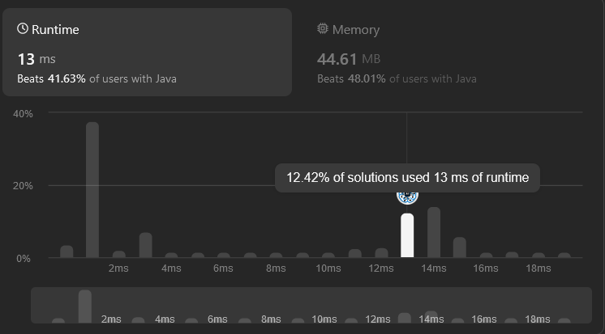
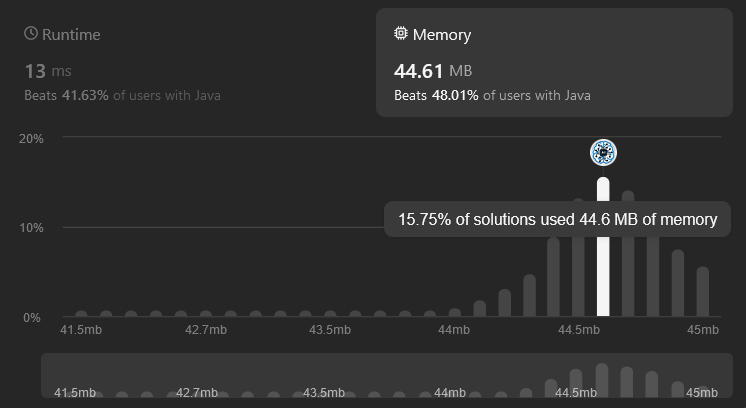

# LeetCode Exercises

## Internship 2024-1
> [!NOTE]
> Welcome to the LeetCode exercises repository for the Internship 2024-1.
> Here, you'll find various challenges related to Computer Science.
> For each problem, you'll find an analysis of its time and space complexity, as well as the execution time and memory usage on LeetCode

### Duplicate Zeros
> * Time complexity: O(n^2)
> * Space complexity: O(1)
> * Execution Time:
> 
> * Memory:
> 

