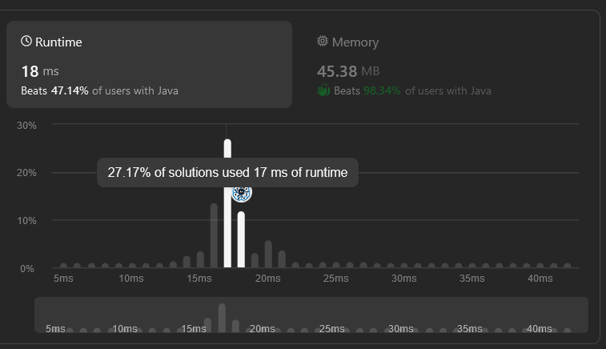

# LeetCode Exercises

## Internship 2024-1
> [!NOTE]
> Welcome to the LeetCode exercises repository for the Internship 2024-1.    
> Here, you'll find various challenges related to Computer Science.    
> For each problem, you'll find an analysis of its time and space complexity, as well as the execution time and memory usage on LeetCode

### Duplicate Zeros (easy)
> * Time complexity: O(n2)
> * Space complexity: O(1)
> * Execution Time:  
    
> * Memory:  
    

### All Elements in Two Binary Search Trees (Medium)
> * Time complexity: O(n)
> * Space complexity: O(n)
> * Execution Time:  
    
> * Memory:  
    

### Bus Routes (Hard)
> * Time complexity: O(N * M)
> * Space complexity: O(V+E) 
> * Execution Time:  
    
> * Memory:  
    

## Longest Valid Parentheses (Impossible)

> * Time complexity: O(n)
> * Space complexity: O(n)
> * Execution Time:  
    
> * Memory:  
    

